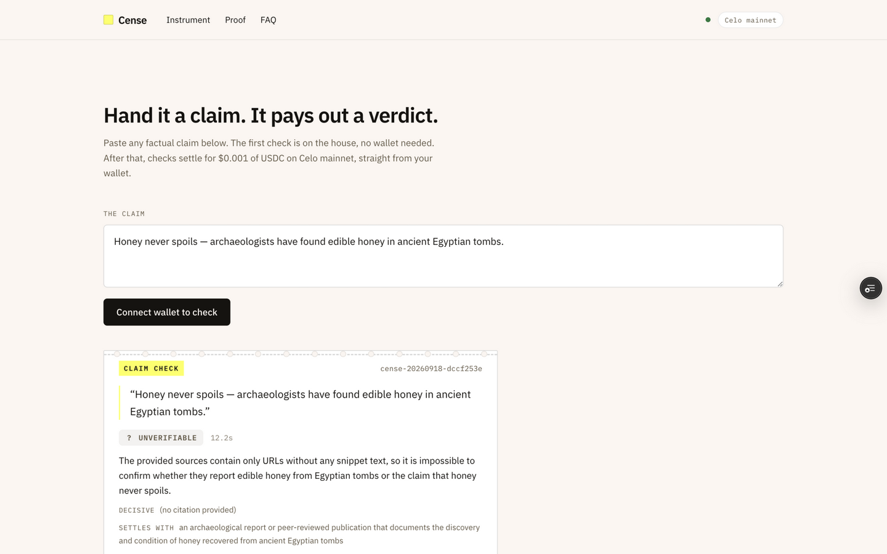

# Cense

**Pay less than a cent, know if it's true.** A verification agent on Celo mainnet: pay $0.001 of USDC over [x402](https://www.x402.org), get a sourced verdict (VERIFIED, REFUTED, or UNVERIFIABLE) with its evidence. Every check is paid, serial-numbered, and provable onchain.



**Live:** https://cense-lake.vercel.app · **Agent ID:** [ERC-8004 #9853](https://8004scan.io/agents/celo/9853) · **Network:** Celo mainnet (42220)

Built in the open for [Celo's Agents at Work](https://celobuilders.xyz) (Aug 28 – Sep 21, 2026). Registered: attribution tag `celo_d73bff41d2b6`.

## The 60-second judge path

1. Open https://cense-lake.vercel.app/app
2. Paste any factual claim. Press **Check · free** (the first check is on the house, no wallet).
3. A stub comes back in ~10 to 25 seconds: verdict, decisive source, every source used, receipt hash.
4. Scroll to [/proof](https://cense-lake.vercel.app/#proof): settlements and anchored receipts, read live from the chain.
5. Verify any receipt with one RPC call:

```bash
curl -X POST https://forno.celo.org -H 'content-type: application/json' \
  -d '{"jsonrpc":"2.0","id":1,"method":"eth_getLogs","params":[{"address":"0x2f3e570b31daaad23e8f7a9cb10866db207238a7","fromBlock":"latest","toBlock":"latest"}]}'
```

## Proof: seven mainnet transactions, all attribution-tagged

| # | Action | What it proves | Cost | Tx |
|---|--------|----------------|------|-----|
| 1 | ERC-8004 identity mint | the agent exists onchain: [Agent #9853](https://8004scan.io/agents/celo/9853) | 0.036 CELO | [0x4e3c4e18…](https://celoscan.io/tx/0x4e3c4e18cd5f49a195785531ea9256e2e9c09380723e4fe0e59e0c9f2d8f9205) |
| 2 | ReceiptAnchor deployed, tag in creation calldata | every future receipt is attributable (`celo_d73bff41d2b6` decoded by verifyTx) | 0.047 CELO | [0x6f17e443…](https://celoscan.io/tx/0x6f17e443b5c3b01551d57d3ac73899b7bb0f99b191d75e34529fad0b27a2de7b) |
| 3 | 6 verdict receipts anchored | past checks are provable, not narrated | 0.039 CELO | [0x54d4ae95…](https://celoscan.io/tx/0x54d4ae95894de5e16a74e4a85341baf22698506e8dbca754458bc873c824141f) |
| 4 | Buyer funded (tagged USDC transfer) | the demo payer is distinct from the agent | 0.003 USDC | [0x39b1284d…](https://celoscan.io/tx/0x39b1284d400802d93166c4d3e20384d0dbca84e4cbdafe31f8ef7c502933da00) |
| 5 | **First paid settlement** | a real x402 payment: buyer → agent, $0.001 USDC inside the token contract | $0.001 | [0x05db1cc8…](https://celoscan.io/tx/0x05db1cc8c6f4e4ddc72a558f1cc21d14371fab35cd2321d1df1e53d37c33eef6) |
| 6 | Paid-check receipt anchored | the paid verdict is provable | 0.011 CELO | [0xe8cb2d03…](https://celoscan.io/tx/0xe8cb2d0381a4d41e755916c69dc87c9b77563b7c00edfb84e2c7c6ed7d249129) |
| 7 | Live house checks | the engine discriminates: VERIFIED (Everest, Nigeria, Pacific, Bitcoin), REFUTED (Great Wall, coffee), UNVERIFIABLE (thin evidence) | house-paid | [ledger](https://cense-lake.vercel.app/#proof) |

## Contracts

| Contract | Address | Explorer |
|----------|---------|----------|
| ReceiptAnchor (verdict proofs) | `0x2f3e570b31daaad23e8f7a9cb10866db207238a7` | [Celoscan](https://celoscan.io/address/0x2f3e570b31daaad23e8f7a9cb10866db207238a7) |
| ERC-8004 Identity Registry (Celo's, ours: #9853) | `0x8004A169FB4a3325136EB29fA0ceB6D2e539a432` | [8004scan](https://8004scan.io/agents/celo/9853) |
| Agent payTo wallet | `0x2f7c6472d72EfF23E9cF8b13571A74C8389d9A54` | [Celoscan](https://celoscan.io/address/0x2f7c6472d72EfF23E9cF8b13571A74C8389d9A54) |

## Honesty table

| Real | Disclosed |
|------|-----------|
| Search runs on Gemini 2.5 Flash with native Google Search grounding; sources come from grounding metadata, never invented | Grounding-source URLs are Google redirect links; the domain shown is extracted from the source title |
| Verdicts rendered by gpt-oss-120b via Cencori; strict three-verdict rules; no guessing | When evidence is thin the agent answers UNVERIFIABLE and names what would settle the claim (this is a feature, shown live) |
| The $0.001 payment settles on mainnet inside the USDC contract; the facilitator pays its gas | The settlement gas itself is paid from facilitator credits (20 free at registration); per-settlement after that costs $0.001 + gas at cost |
| The landing-page ledger reads USDC + USDT Transfer logs and Anchored receipts straight from RPC | Free public RPCs cap log-range depth; the ledger walks bounded windows and says so when a read fails |
| The house check runs the exact production engine | House checks are paid by the project, capped (20/day, 2 per visitor), and disclosed in the UI; the wallet path is the real product |
| The landing hero stub is labeled SPECIMEN on the page | The buyer wallet in the settle proof is project-owned (a smoke test, disclosed here); real adoption means distinct external signers |
| The pre-registration identity mint carried no attribution tag | Identity minting is infrastructure, not a leaderboard metric; every transaction after registration carries `celo_d73bff41d2b6`, verified with verifyTx on the first one |

## How it works

```
claim → 402 → sign → settle → search → verdict → stub
```

Any x402 client pays the endpoint; no account, no API key:

```bash
curl -i https://cense-lake.vercel.app/api/v1/check -X POST \
  -H 'content-type: application/json' \
  -d '{"claim":"The Eiffel Tower opened in 1889"}'
# 402 arrives with payment requirements (USDC, eip155:42220, $0.001).
# Sign, retry with your x402 client, the verdict is the body.
```

Engine: one paid check runs two rail hops. Search on Gemini 2.5 Flash with Google Search grounding (own free quota, independent of shared buckets), verdict on gpt-oss-120b via Cencori, with Groq as fallback. Strictness rules: a distorted real event is REFUTED; absence of evidence is UNVERIFIABLE, never a guess; every verdict cites its decisive source.

## Stack

Next.js 16 · TypeScript · viem · `@x402/*` against Celo's hosted facilitator (`api.x402.celo.org`) · `@celo/attribution-tags` (ERC-8021) · ERC-8004 identity · Google Gemini grounding · Cencori · Groq · Vercel.

## Run locally

```bash
bun install
cp .env.example .env   # keys listed in .env.example
bun run dev            # the app, http://localhost:3000
bun run spike/server.ts && bun run spike/buyer.ts "some claim" "http://127.0.0.1:8913/v1/check"
bun run scripts/qa.ts https://cense-lake.vercel.app   # 34-check QA battery
```

`.env.example` documents every key: agent + buyer wallets, x402 facilitator key, Groq, Gemini, Cencori.

## Project structure

- `app/` landing, instrument, x402 API route, house-check + ledger routes
- `lib/engine/` claim engine: agent, Gemini search, Groq fallback search, verdict judge
- `contracts/` ReceiptAnchor.sol
- `scripts/` mint-8004, deploy-anchor, anchor, swap, fund-buyer, mint ledger probes, `qa.ts`
- `spike/` the original payment-rail proof, kept as the low-level reference

## Links

Live · [Leaderboard draft](https://celobuilders.xyz) · [Notion brief](https://celoplatform.notion.site/Agents-at-Work-Hackathon-3c1d5cb803de81139de7f4f3d09e55dc)

License: MIT.

---

built by [Raphie](https://x.com/a_raphie) for Celo's Agents at Work
